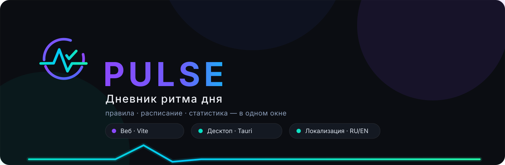
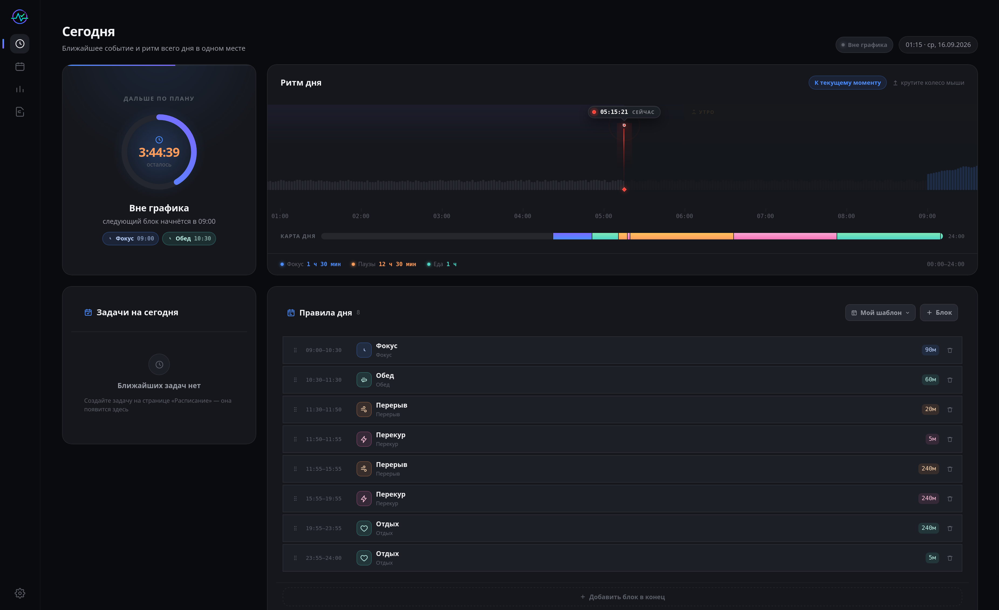
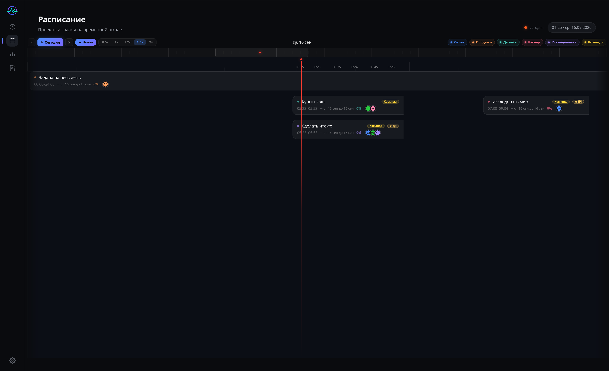

<div align="center">
  
</div>

<p align="center">
  <a href="#о-приложении">О приложении</a> ·
  <a href="#скриншоты">Скриншоты</a> ·
  <a href="#возможности">Возможности</a> ·
  <a href="#технологии">Технологии</a> ·
  <a href="#быстрый-старт">Быстрый старт</a> ·
  <a href="#структура-проекта">Структура</a> ·
  <a href="#скрипты">Скрипты</a>
</p>

---

## О приложении

**Pulse** — это инструмент, который выстраивает **ритм всего дня** из простых правил активности. Вы задаёте блоки — фокус, перерыв, обед, отдых — а Pulse собирает из них цельный график: от ближайшего события до дневной статистики. Никаких жёстких расписаний: вы задаёте *количество*, приложение следит за *ритмом*.

```text
Правила дня ──► Ритм дня ──► Расписание ──► Статистика
```

<table>
  <tr>
    <td align="center" width="33%" style="border:1px solid #e7eaf1;border-radius:12px;padding:18px 16px;">
      <b>Один код — две платформы</b><br/>
      <span style="color:#8B93A7;font-size:14px;">Тот же интерфейс работает в браузере (Vite)<br/>и как нативное приложение (Tauri)</span>
    </td>
    <td align="center" width="33%" style="border:1px solid #e7eaf1;border-radius:12px;padding:18px 16px;">
      <b>RU / EN из коробки</b><br/>
      <span style="color:#8B93A7;font-size:14px;">Полная локализация интерфейса<br/>переключается в один клик</span>
    </td>
    <td align="center" width="33%" style="border:1px solid #e7eaf1;border-radius:12px;padding:18px 16px;">
      <b>Светлый и тёмный</b><br/>
      <span style="color:#8B93A7;font-size:14px;">Тема подстраивается под систему<br/>или выбирается вручную</span>
    </td>
  </tr>
</table>

## Скриншоты

<table>
  <tr>
    <td align="center" width="50%" style="border:1px solid #e7eaf1;border-radius:14px;padding:12px;">
      
      <p style="margin:10px 0 4px;"><b>Сегодня</b> · ближайшее событие и ритм дня</p>
    </td>
    <td align="center" width="50%" style="border:1px solid #e7eaf1;border-radius:14px;padding:12px;">
      
      <p style="margin:10px 0 4px;"><b>Расписание</b> · блоки на временной шкале</p>
    </td>
  </tr>
</table>

## Возможности

<table>
  <tr>
    <td width="50%" style="border:1px solid #e7eaf1;border-left:4px solid #4468FC;border-radius:10px;padding:16px 18px;">
      <b>Сегодня</b>
      <br/><span style="color:#5b6472;font-size:14px;">Ближайшее событие, сетка «Ритм дня» и задачи — всё в один взгляд</span>
    </td>
    <td width="50%" style="border:1px solid #e7eaf1;border-left:4px solid #8B49FD;border-radius:10px;padding:16px 18px;">
      <b>Расписание</b>
      <br/><span style="color:#5b6472;font-size:14px;">Проекты и блоки на Gantt-таймлайне с чётким визуальным разделением</span>
    </td>
  </tr>
  <tr>
    <td width="50%" style="border:1px solid #e7eaf1;border-left:4px solid #06E1C6;border-radius:10px;padding:16px 18px;">
      <b>Статистика</b>
      <br/><span style="color:#5b6472;font-size:14px;">Area-чарты и сводные карточки: продуктивность за любой период</span>
    </td>
    <td width="50%" style="border:1px solid #e7eaf1;border-left:4px solid #23F7A9;border-radius:10px;padding:16px 18px;">
      <b>Шаблоны</b>
      <br/><span style="color:#5b6472;font-size:14px;">Отдельные графики дня под понедельник и выходные — своя структура</span>
    </td>
  </tr>
  <tr>
    <td width="50%" style="border:1px solid #e7eaf1;border-left:4px solid #FF9D5C;border-radius:10px;padding:16px 18px;">
      <b>Правила дня</b>
      <br/><span style="color:#5b6472;font-size:14px;">Редактор с пресетами длительности, drag-сортировкой и цветами</span>
    </td>
    <td width="50%" style="border:1px solid #e7eaf1;border-left:4px solid #6E5DFC;border-radius:10px;padding:16px 18px;">
      <b>Настройки</b>
      <br/><span style="color:#5b6472;font-size:14px;">Профиль, цель дня, старт ритма — плюс тема и язык интерфейса</span>
    </td>
  </tr>
</table>

## Технологии

| Слой | Стек |
|---|---|
| Frontend | **React 19** · **TypeScript** |
| Styling | **Tailwind CSS 4** · HeroUI |
| Анимации | framer-motion · motion |
| Графики | visx · d3 (area / bar / pie / ring) |
| Маршрутизация | react-router-dom |
| Локализация | react-i18next |
| Desktop | **Tauri 2** (Rust) |
| Tooling | Vite 8 · oxlint |

## Быстрый старт

> **Требования:** Node.js 22+ и npm. Для десктоп-сборки дополнительно нужен Rust — [системные требования Tauri](https://v2.tauri.app/start/prerequisites/).

Установите зависимости:

```bash
npm install
```

Запуск в браузере (режим разработки, hot-reload):

```bash
npm run dev
```

Откроется на `http://localhost:5173`.

Запуск настольного приложения:

```bash
npm run tauri dev
```

Продакшен-сборки:

```bash
# Веб: типизация + сборка → предпросмотр
npm run build && npm run preview

# Десктоп: нативные пакеты (.deb, .rpm, .AppImage …)
npm run tauri build
```

## Структура проекта

```text
src/
├── app/          # Инициализация, маршрутизация, глобальные стили
├── pages/        # Сегодня · Расписание · Статистика · Настройки · Шаблоны
├── widgets/      # TitleBar · Sidebar · NextUp · Timeline · GanttTimeline · Toast
├── features/     # add-rule — редактор «Правила дня»
├── entities/     # rhythm — сущность «Ритм дня» · templates
└── shared/       # hooks · ui · lib · config (i18n) · types
src-tauri/        # Десктоп-оболочка: окно, бандлинг, иконки
```

Архитектура — **Feature-Sliced Design**: зависимости направлены строго сверху вниз `app → pages → widgets → features → entities → shared`.

## Скрипты

| Команда | Описание |
|---|---|
| `npm run dev` | Dev-сервер Vite |
| `npm run build` | `tsc -b && vite build` — типизация + продакшен |
| `npm run preview` | Предпросмотр собранного веб-приложения |
| `npm run lint` | Проверка кода (oxlint) |
| `npm run tauri` | CLI Tauri — `dev`, `build` и т.д. |

---

<p align="center">
  <span style="color:#c8cdd9;">Pulse · дневник ритма дня</span>
</p>